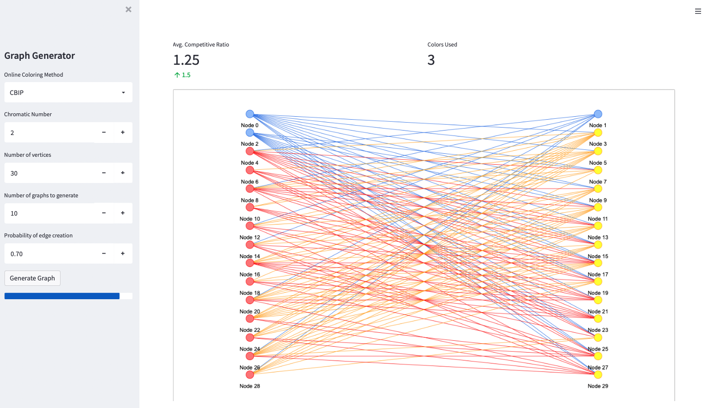

# COMP 6651 Project
### Authors: Sahil Pattni, Pablo Ilabaca Parra
---
<!-- insert image here -->


## Project Description
This project is an empirical study of the average competitive ratio using both the FitFirst and CBIP algorithms.

---

## Running the Project
All experiements may be run [from the web application here](https://sahil-pattni-comp-6651-project-srcapp-6hpg5f.streamlit.app).

```NOTE: This web application is hosted on Streamlit Community Cloud, which will be undergoing scheduled maintenance on April 18 and April 20, 2023 between 8 a.m. and 12 p.m. GMT.```

The web application is hosted on Streamlit Sharing, which may take a few minutes to load if the application has not been used recently. The sidebar on the left contains the controls for the application, and has the following options:
- `Graph Generation Method`: `Generate Graph` to generate a random k-colorable graph, or `Example Graph` to use the example bipartite graph shown in the project description.
- `Online Coloring Method`: `FitFirst` to use the FitFirst algorithm, or `CBIP` to use the CBIP algorithm.
- `Chromatic Number`: The chromatic number of the graph. This is only used when `Generate Graph` is selected. The maximum value has been restricted to 4 to prevent the application from taking too long to run. Note that due to how the graph is generated, it is only guaranteed to have a chromatic number $\leq$ the specified value.
- `Number of Vertices`: The number of vertices in the graph. This is only used when `Generate Graph` is selected. Equivalent to $n$ as specified in the project description.
- `Number of graphs to generate`: The number of graphs to generate. Equivalent to $N$ as specified in the project description.
- `Probability of edge creation`: The probability of an edge existing between two vertices. This is only used when `Generate Graph` is selected. Equivalent to $p$ as specified in the project description.


Alternatively, the project may be run locally by following the instructions below.
### Prerequisites
This project requires Python 3.8 or higher. It is recommended to use a virtual environment to run this project. To install the required dependencies, run the command `pip install -r requirements.txt` from the root directory of this project.

### File Structure
The `src` directory contains the following files:
- `app.py`: The main entry point for the web application.
- 

### Running the Project
To run the web application, run the command `streamlit run src/app.py` from the root directory of this project.
The study of the FitFirst algorithm can be found in the `FitFirst_Study.ipynb` notebook.
The study of the CBIP algorithm can be found in the `CBIP_Study.ipynb` notebook.

## Running the tests
The tests can be run from the root directory of this project via the command:
`python -m unittest discover tests`.